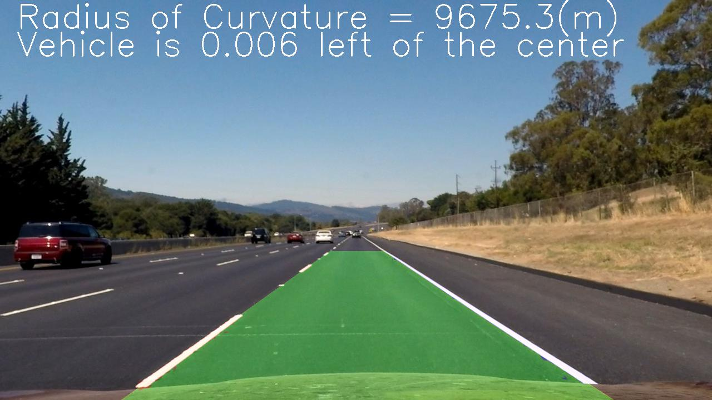

## Advanced Lane Finding

## Project 2 (Self-Driving Car Engineer - Udacity)

**Advanced Lane Finding Project**

The goals / steps of this project are the following:

* Compute the camera calibration matrix and distortion coefficients given a set of chessboard images.
* Apply a distortion correction to raw images.
* Use color transforms, gradients, etc., to create a thresholded binary image.
* Apply a perspective transform to rectify binary image ("birds-eye view").
* Detect lane pixels and fit to find the lane boundary.
* Determine the curvature of the lane and vehicle position with respect to center.
* Warp the detected lane boundaries back onto the original image.
* Output visual display of the lane boundaries and numerical estimation of lane curvature and vehicle position.

[//]: # (Image References)

[image1]: ./camera_cal/calibration3.jpg "Distorted"
[image2]: ./result_images/calibration3_dst.jpg "Undistorted"
[image3]: ./test_images/test4.jpg "Distorted"
[image4]: ./output_images/udst_test4.jpg "Undistorted"
[image5]: ./output_images/lines_test4.jpg "Line detection"
[image6]: ./result_images/straight_lines1.jpg "Undistorted"
[image7]: ./result_images/straight_lines1_bev.jpg "Bird eye view"
[image8]: ./output_images/warp_text5.jpg "Warped image"

[video1]: ./project_video.mp4 "Video"

## [Rubric](https://review.udacity.com/#!/rubrics/571/view) Points

### Here I will consider the rubric points individually and describe how I addressed each point in my implementation.  

### Camera Calibration

#### 1. Obtaining the camera matrix and distortion coefficients. Provide an example of a distortion corrected calibration image.

The code for this step is contained in the first code cell of the IPython notebook located in "./calibration_and_perspetive.ipynb".   

Initally,  I create a list of images in the camera_cal folder, they corresponds to images taken to a 9x6 chessboard in different positions.  The parameters of the chessboard and it's coordinates are set in the world reference frame.  Here I am assuming the chessboard is fixed on the (x, y) plane at z=0, such that the object points are the same for each calibration image.  

Two vectors are created, one for the `object points` and another one for the `image points`. Each image in the folder is converted to gray scale and throught opencv function `findChessboardCorners` I obtain the corners of the chessboard in image frame.  If the corners are successfully extracted, I save the image coordinates and the object coordinates in the arrays. 

The `object points` and  `image points` are used to compute the camera calibration and distortion coefficients using the `cv2.calibrateCamera()` function.  This piece of code saves the intrinsic parameters into a file to be used in future.
I applied this distortion correction to the test image using the `cv2.undistort()` function and obtained this result: 

![alt text][image1]   ![alt text][image2]

### Pipeline (single images)

#### 1. Distortion-corrected image.

I read the camera parameters from the file generated by the camera calibration code. To demonstrate this step. I used  the opencv function `undistort` to undistort the images, it requires the original image and the camera intrinsic parameters. This code can be found in the line 210 of `pipe_line_test_images.pynb`.  Here an example:

![alt text][image3]   ![alt text][image4]

#### 2. Line extraction. 

In this step, I used a combination of color and gradient thresholds to generate a binary image (thresholding steps at lines 8 through 47 in `pipe_line_test_images.ipynb`).  
Since white color has a very high saturation value, I use this channel in our pipeline to detect the lines.  I dentify that the yellow color has a Hue between 20 and 30, for this reason this channel was also included. Finally I  check for gradients in x from the saturation channel (illumination robust)

Here's an example of this step. 

![alt text][image3]    ![alt text][image5]

#### 3. Perspective transformation.

The code for this step is contained in the second code cell of the IPython notebook located in "./calibration_and_perspetive.ipynb".   Here, we hardcoded the source and destionation points as: 

| Source        | Destination   | 
|:-------------:|:-------------:| 
| 202, 719      | 315, 720      | 
| 591, 452      | 315, 0        |
| 696, 452      | 970, 0        |
| 1123, 719     | 970, 720      |

I verified that my perspective transform was working as expected by drawing the `src` and `dst` points onto a test image and its warped counterpart to verify that the lines appear parallel in the warped image.

![alt text][image6]    ![alt text][image7]

The transformation matrices (from source to destination and viceversa) are saved in a file for future usage. I read this file in the pipeline in the line 199  in `pipe_line_test_images.ipynb`.

In the pipeline, the code for my perspective transform includes an opencv function called `warpPerspective()`, which appears in  the line 210 in the file `pipe_line_test_images.ipynb`.  This function takes as inputs an image , and the transformation matrix to create the bird eye view of the road.

#### 4. Lane-line pixels and fit their positions with a polynomial

To fit the lane lines I used a  2nd order polynomial : 
$$f(x)=Ax2+Bx+C$$
where the coefficients are calculated by the numpy function `polyfit`. To have accurate parameters the input to the function have to be point coordinates which belongs to the lines on the road. 
The points of each line are extracted initially by checking the peaks from a histogram created by 1/3 of the image corresponding to the bottom of it. In this way, we can have an estimate of where the lines start in the image.  If the lines have been previously detected successfully, we obvious this step and used the starting point in the last frame. 
We check for correctness in the starting points, since we know beforehand an approximation of the lane width, it's possible to assess if the distance between lanes corresponds to valid lane width. 

A window technique is used then to obtain the lane markings. Starting from the previous step, a window is located in each starting point, this window is vertically slid and recentred based on the line points within it.  
The valid points $(x,y)$ of each line are then fitted, if it's not possible to fit a line to them, we used the saved parameters of a valid line. 

With the parameters of each line is possible to create a mask of the detected lane. An example of it is shown in the following image. 

![alt text][image8]

#### 5. Calculation of the radius of curvature of the lane and the position of the vehicle with respect to center.

I did this in lines 185 through 190 in my code in `pipe_line_video.ipynb`. The radious of curvature is calulated using the following equation:
$$
Radious = \frac{[1+\frac{dy}{dx}^2]^{3/2}}{|\frac{d^2y}{d^2x}|}
$$

In the previous step besides fitting a polynomium in pixel coordinates, an alternate polynomium in world coordinates was also obtained. To do this we used we scale each pixel with it's approximate value in real world. 
$$ym\_per\_pix = 35/700$$
 $$xm\_per\_pix = 3.7/660$$

With these two pieces of information we opted to calculate the radious of curvature at the bottom of the image. 

On the other hand, to calulate how centered the vehicle is from the lane,  I use the following equation

$$
deviation = (640 - (0.5 * left_x + 0.5 * right_x)) * xm\_per\_pix 
$$

where 640 corresponds to the 0.5*image\_size\_x and $(left_x , right_x)$  are the coordinates in $x$ axis the fitted lines at the bottom of the image.  By multiplying for $xm\_per\_pix$ I can obtain the value in meters. 

#### 6. Provide an example image of your result plotted back down onto the road such that the lane area is identified clearly.

From step 4 a warped image is generated, it contains the line points and the area which was identified as lane. I translated that mask back to the undistorted image. I implemented this step in lines 253 through 256 in my code in `pipe_line_video.ipynb` .  Here is an example of my result on a test image:

![alt text][Lanes Image]

---

### Pipeline (video)

Here's a [link to my video result](./project_video_output.mp4)

---

### Discussion

Here I'll talk about the approach I took, what techniques I used, what worked and why, where the pipeline might fail and how I might improve it if I were going to pursue this project further.  

### Reflection

My pipeline consisted of 6 steps: Undistortiong, Line detection, Perspective transform, Line fitting, Calculations (radius of curvature and deviation from the centre) and  Translation of the lane region to the undistorted image.  A long this document,  each of these steps were explained where images show how the pipeline works. 

### Identify potential shortcomings with your current pipeline

At the moment the threshold are hard coded to the environment presented in `project_video.mp4`, different illumination conditions will make the pipeline fail. 

One potential shortcoming would be what would happen when there's only one line detected by the camera. Occlussions of the lines, might also generate wrong values for the lines, that is, if a white car change lanes in front of us that car could be detected as part of the line. 

### 3. Suggest possible improvements to your pipeline

The current pipeline shows an Ok performance in the challenge video, nevertheless, I think the lane detection algorithm can be improved through applying more masks to the final binary image. 
For the harder challenge video, the pipeline has a very poor performance, the illumination changes quicky and the curves of the road have a curvature which makes the left lane to disappear, this case wasn't taken into account in the current pipeline.  Thus, a possible improvement is to add these cases into the pipeline by tracking the detecting lines. 
A possible improvement would be to have dynamic thresholds to compare to, instead of hardcoded values.
The current pipeline doesn't do any tracking or filtering of the line parameters, that needs to be to done to improve its performance. 
The code needs to be refactored in order to be more modular, so errors can be detected and fixed easily. 

